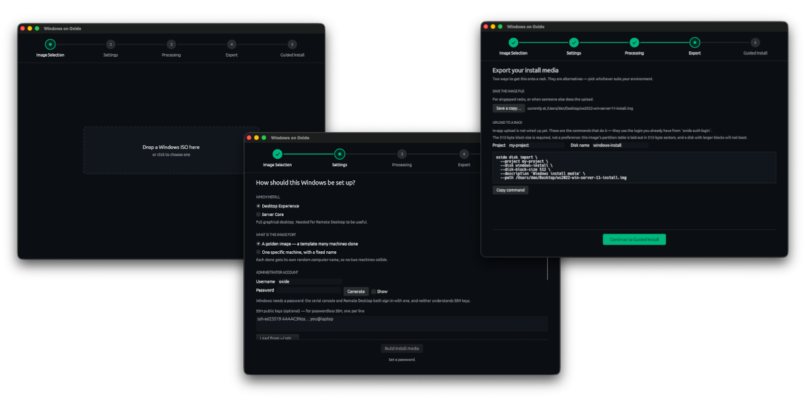

# Windows Image Builder

Get Windows Server running on an Oxide rack, from your laptop.

The Oxide rack requires a serial console, and VirtIO drivers installed within a
Windows image for that image to function. This repo contains an applications which
can take a Windows install ISO, and then convert it into a format compatible with
the rack and its normal operating mode.



---

## What you need before you start

- **A Windows ISO.** Server 2019, 2022 or 2025, or Windows 10 or 11. Microsoft's
  evaluation ISOs work fine and need no product key. The app reads the ISO to find out
  which release it is, so there is nothing to select — see
  [Which Windows versions work](#which-windows-versions-work) for what has been verified.
  Arm64 media is refused.
- **Around 20 GB of free disk space.** The image it builds is roughly the size of your
  ISO, and it has to be written somewhere before it is uploaded.
- **An SSH public key** is optional. If you have used SSH before you already have one,
  at `~/.ssh/id_ed25519.pub`. It makes SSH passwordless, but it does not replace the
  password — see below.


> **Running it today:** this is an early version, so you start it from source rather
> than double-clicking an app. You need [Rust](https://rustup.rs), then:
>
> ```
> cargo run --release -p oxwin-gui
> ```
>
> A packaged, double-clickable app is on the roadmap. You do not need to mount the ISO
> first — drop the `.iso` straight in.

---

## The five stages

The app walks you left to right along the top of the window. A circle turns green when
that stage is finished. You can click back to any green stage to change something.

### 1. Image Selection

Drag your Windows ISO anywhere onto the window, or click the box to pick one. The app
tells you how big it is so you can catch it immediately if you grabbed the wrong file.

You can also start the app with a file: `cargo run -p oxwin-gui -- path/to/windows.iso`.

### 2. Settings

**Is this a golden image, or one specific machine?**

- **Golden image** — a template. You install it once, then clone it for every future
  Windows machine. The installed machine takes a randomly generated computer name rather
  than a fixed one. Choose this if you are not sure; it is the more useful thing to have.

  **A golden image ends powered off, and that is the point.** Once the install
  finishes, the machine generalizes itself with sysprep and shuts down. That is what
  makes it cloneable — without it every clone would keep this machine's name *and* its
  SID, which is the problem a golden image exists to avoid. Take your snapshot once it
  has stopped. Clones do not generalize themselves again.
- **One specific machine** — you type the computer name, and it keeps it. Up to 15
  characters, letters, digits and hyphens.

**The administrator account.**

Set a username and a password. **Windows needs a password** — there is no way around
it. The serial console and Remote Desktop both sign in with one, and neither knows
anything about SSH keys, so an account with only a key would be reachable over SSH and
nowhere else, including from the serial console you need when something has gone wrong.

Use **Generate** if you would rather not invent one; it produces a 20-character
password that satisfies Windows' complexity rules, and **Copy** puts it on your
clipboard. Write it down before you move on.

SSH public keys are optional and additive: add one and SSH stops asking for the
password. The password still exists for everything else.

Two things to know about that password:

- It is stored as **plain text** in the answer file on the install media. Anyone who
  can read the image, or the disk once uploaded, can read it.
- On a **golden image**, every machine you clone inherits it. Change it after first
  boot, or build a separate image per machine.

**Access and hardware.** Sensible defaults are already set. The two worth
understanding:

- **Inject virtio drivers** — leave this on. Without it Windows installs fine and
  then has no network, which is a confusing thing to debug.
- **Enable the serial console** — leave this on. It is how you watch the install
  happen, and it is your only way in if something goes wrong.

### 3. Processing

The app builds the image. It copies several gigabytes, so this takes a few minutes.
You can leave it running and come back. "Show details" reveals what it is doing if
you are curious or something looks wrong.

### 4. Export

Three ways to get the image onto a rack. They are alternatives — pick one.

- **Save the image file.** Writes the image wherever you want. Use this if your rack
  is airgapped, or if someone else does uploads. Nothing else is needed from this app.
- **Upload it as a disk.** The app uploads the image itself, using the login you already
  have from `oxide auth login`, with a progress bar. Pick which rack if you are logged
  into more than one.
- **Upload it and build the instance.** The same upload, and then the blank system disk
  and the instance, booting from the installer with an external IP so you can reach it.
  This is the whole of stage 5 done for you.

The equivalent commands are still there under "Or run it yourself". Nothing on this
screen depends on the app being able to reach your rack.

If you would rather script it, the CLI does the same three things:

```
oxwin build <iso> out.img --password=… --name=…
oxwin upload out.img --project=<p> --disk=<name>
oxwin instance <name> --project=<p> --installer-disk=<name>
```

### 5. Guided Install

A numbered checklist of everything left to do on the rack, with the commands filled in
using the names you chose. Work down it in order.

---

## What happens on the rack

Worth knowing, because otherwise the middle of the install looks broken.

You end up with **two disks**: the installer image you just built, and a blank disk for
Windows to install onto. The instance boots from the installer first. Windows installer
does not output information over serial, the system will look like nothing is happening
after loading the boot loader. Windows desktop editions (10 and 11) will never output
anything over serial.

From there it runs by itself. It partitions the blank disk, installs Windows, sets up
your account, installs the network drivers and the SSH server, and turns on Remote
Desktop if you asked for it.

**It will reboot several times. This is normal.** Windows Setup always does. Do not
intervene; let it finish.

When it is done, the installer disk notices there is now a working Windows on the other
disk and boots that instead, every time from then on. So it is safe to leave attached —
you do not have to time anything or catch a window. Once the install is finished you can
detach it whenever it is convenient.

---

## Making a golden image

A golden image is a Windows image you can stamp out copies of. Instead of running the
installer every time, you install once, strip the machine of its identity, and turn
that into an image the rack can create new instances from in a couple of minutes.

The whole thing is one command:

```
oxwin golden ~/path/to/windows.iso --run=ws2022 --project=<your project> \
  --user=oxide --password=… --ssh-key="$(cat ~/.ssh/id_ed25519.pub)"
```

It takes about half an hour, most of it spent watching an install that nobody has to
sit through. It builds the media, uploads it, creates a temporary instance, waits for
Windows to install and shut itself down, snapshots the disk, turns the snapshot into
an image, and deletes everything temporary. What is left is the image, named after
`--run`.

**If it stops — a laptop lid, a lost connection, a Ctrl-C — run exactly the same
command again.** It works out what already exists on the rack and carries on from
there. Nothing is kept on your machine, so it does not matter which machine you resume
from, and nothing is ever deleted because something went wrong: a failure prints what
exists and how to continue.

`--keep=` controls what survives. The default keeps the image and removes the rest;
`--keep=all` removes nothing, which is what you want when something has gone wrong and
you would like to look at it.

### Checking that it worked

```
oxwin golden … --verify-clone
```

Adds a last step: create an instance from the finished image and require it to come up
**and stay up**. Staying up is the point. A broken golden image comes up fine and then
powers itself off a minute later, so a check that stopped as soon as the machine
answered would pass on exactly the image that is broken.

One thing this cannot check for you. Log into the clone and confirm its computer name
differs from the machine the image came from:

```
hostname
```

If two clones share a name they share a Windows security identifier as well, and that
is the collision the whole exercise exists to prevent.

### If you would rather drive it yourself

The steps are separate commands too — `oxwin upload`, `instance`, `watch`, `snapshot`,
`image`, `teardown` and `verify` — all taking the same `--run` name. `oxwin --help`
lists them.

---

## If something goes wrong

**Remote Desktop times out, but SSH works.**
The most common surprise, and it is not your Windows configuration. An Oxide VPC allows
only SSH and ping by default, so RDP traffic is dropped before it ever reaches Windows.
Turning on RDP in this app is necessary but not sufficient — you also need a VPC
firewall rule allowing inbound `tcp/3389`. Add that and it will work.

**The uploaded disk will not boot at all.**
Check the block size. The image's partition table is laid out in 512-byte sectors, so
the disk has to be imported with `--disk-block-size 512`. With larger blocks every
partition offset lands in the wrong place and the firmware finds nothing to boot. The
command the app gives you already includes the flag; a hand-written one might not.

**Windows installed but has no network.**
The virtio drivers were not injected. Rebuild with that box ticked.

**The install seems stuck.**
Watch the serial console — `oxide instance serial console` — before assuming it is
wedged. Setup spends long stretches looking idle, and reboots on its own several times.

**It keeps booting the installer instead of Windows.**
Check that both disks are attached and that the installer is the boot disk. The
installer only hands over once it can see a working Windows on another disk.

**Nothing happens for a few minutes after the installer starts.**
Expected. The screen stays blank between the boot menu and Setup appearing — usually
two or three minutes. The media says so before it hands over. Nothing needs your
input at any point, and the machine reboots itself several times before it is done.
Resetting it during that window is the one way to turn a working install into a
broken one.

**The app says it cannot build images.**
A released binary carries the payload inside it, so this means you built from source
without it. Run `./tools/fetch-payload.sh` — which downloads the virtio drivers, OpenSSH
and the EFI binaries the media carries — and build again. To point an existing binary at
a payload directory instead of rebuilding, set `OXWIN_ASSETS` to it.

---

## Which Windows versions work

| Version | Status |
| --- | --- |
| Windows Server 2022 | **Verified** — installed on real Oxide hardware, with networking, SSH and RDP confirmed working |
| Windows Server 2019 | **Verified** — installed on real Oxide hardware, with networking, SSH and RDP confirmed working |
| Windows Server 2025 | Builds, but does not yet install — see [the two blockers](TESTED-MEDIA.md#hardware-verification-status) |
| Windows 10 | **Verified** — installed on real Oxide hardware, with networking, SSH and RDP confirmed working |
| Windows 11 | Builds, but does not yet install — same two blockers as Server 2025 |
| Any Arm64 release | Refused, with a message saying why. The drivers and answer file are amd64 only |

**You do not tell the app which Windows you have — it reads the ISO and works it out.**
That is deliberate: a version picker is a claim nobody checks, and choosing wrongly used
to produce an image that built cleanly and then installed a machine with no network. If
the release you selected disagrees with the media, the media wins and the log says so.

Windows versions come with many different versions of media, see [TESTED-MEDIA.md](TESTED-MEDIA.md) for exactly what has
been tested on each.

---

## Where things are

- `crates/` — the app: `oxwin-core` the engine, `oxwin-rack` the rack client,
  `oxwin-gui` the desktop app, `oxwin-cli` the command-line one
- `assets/` — third-party payload, downloaded by `tools/fetch-payload.sh`, not committed
- `DEVELOPMENT.md` — how it works inside, and how to work on it
- `PLAN.md` — what is built, and what is coming
- `TESTED-MEDIA.md` — which Windows ISOs this has actually been run against
