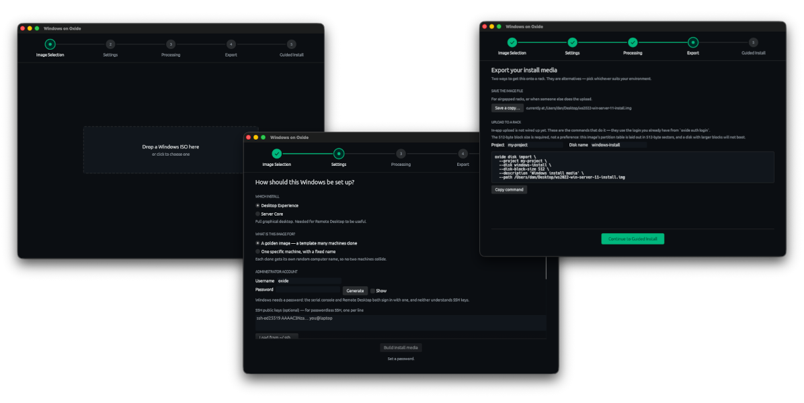

# Windows Image Builder (`oxwin`)

Get Windows running on an Oxide rack.

**One binary, two ways to use it.** `oxwin` is the app when you click it and the CLI
when you give it arguments — the same engine either way, so anything the wizard can
build a script can build too.

The Oxide rack requires a serial console, and VirtIO drivers installed within a
Windows image for that image to function. This repo contains an applications which
can take a Windows install ISO, add drivers, and then convert it into a format
compatible with the Oxide hypervisor.



---

## What you need before you start

- **A Windows ISO.** Server 2019, 2022, or Windows 10. Microsoft's
  evaluation ISOs work fine and need no product key. The app reads the ISO to find out
  which release it is, so there is nothing to select — see
  [Which Windows versions work](#which-windows-versions-work) for what has been verified.
  Arm64 media is refused.
- **Around 20 GB of free disk space.** The image it builds is roughly the size of your
  ISO, and it has to be written somewhere before it is uploaded.
- **An SSH public key** is optional. If you have used SSH before you already have one,
  at `~/.ssh/id_ed25519.pub`. It makes SSH passwordless, but it does not replace the
  password — see below.


## Running it

Download the archive for your platform from the releases page and open it. There is
nothing to install and nothing else to download — the drivers, OpenSSH and EFI
binaries are compiled into the binary. You do not need to mount the ISO first; drop
the `.iso` straight in.

- **macOS** — open `Windows Image Builder.app`. The loose `oxwin` beside it is the
  same binary, for the command line.
- **Windows** — double-click `oxwin.exe`.
- **Linux** — run `oxwin`. For a launcher entry, install
  `oxide-windows.desktop` (the comments in it say how).

These builds are not signed yet. macOS will refuse a downloaded app until you clear
its quarantine attribute:

```
xattr -dr com.apple.quarantine "Windows Image Builder.app" oxwin
```

`oxwin doctor` prints what it found — the payload it carries, and which racks this
machine is logged into. It is the first thing to run if something looks wrong.

> **From source**, if you would rather: you need [Rust](https://rustup.rs), then
> `cargo run --release -p oxwin`. During development `cargo run -p oxwin-gui` and
> `cargo run -p oxwin-cli` build the two front ends separately, which is faster —
> the CLI that way does not link the windowing stack.

### Using it as a CLI

Give it a command and it never opens a window:

```
oxwin --help                   # the commands, and every flag
oxwin doctor                   # what this build carries, and your rack logins
oxwin build windows.iso out.img --password=… --name=…
```

One Windows-only wrinkle: `oxwin.exe` is linked as a GUI binary, because that is
what makes a double-click not flash a console window. It prints to the console that
started it, but the shell does not wait for it — so in a script that depends on
ordering, use `start /wait oxwin.exe …` or pipe through `| Out-Host`.

---

## The five stages

### 1. Image Selection

Drag your Windows ISO anywhere onto the window, or click the box to pick one. The app
tells you how big it is so you can catch it immediately if you grabbed the wrong file.

You can also start the app on a file: `oxwin path/to/windows.iso`. On macOS, "Open
With" and dropping an ISO on the Dock icon do the same thing.

### 2. Settings

**Is this a golden image, or one specific machine?**

- **Golden image** — a template. You install it once, then clone it for every future
  Windows machine. The installed machine takes a randomly generated computer name rather
  than a fixed one. Choose this if you are not sure; it is the more useful thing to have.

  **A golden image ends powered off, and that is the point.** Once the install
  finishes, the machine generalizes itself with sysprep and shuts down. That is what
  makes it cloneable — without it every clone would keep this machine's name *and* its
  SID, which is the problem a golden image exists to avoid.
- **One specific machine** — you type the computer name, and it keeps it. Up to 15
  characters, letters, digits and hyphens.

**The administrator account.**

Set a username and a password. **Windows needs a password** — there is no way around
it. The serial console and Remote Desktop both sign in with one, and neither knows
anything about SSH keys, so an account with only a key would be reachable over SSH and
nowhere else, including from the serial console you need when something has gone wrong.

SSH public keys are optional and additive: add one and SSH stops asking for the
password. The password still exists for everything else.

Two things to know about that password:

- It is stored as **plain text** in the answer file on the install media. Anyone who
  can read the image, or the disk once uploaded, can read it.
- On a **golden image**, every machine you clone inherits it. Change it after first
  boot, or build a separate image per machine.

**Access and hardware.** Sensible defaults are already set. Worth understanding:

- **Inject virtio drivers** — leave this on. Without it Windows installs fine and
  then has no network, which is a confusing thing to debug.
- **Enable the serial console** — leave this on. It is how you watch the
  *installed* OS happen, once it exists, and it is your only way in if something
  goes wrong.
- **Serial output during Windows Setup (EMS)** — leave this on too. It is a
  separate switch, because it covers the earlier moment: without it, Setup itself
  is silent on serial and the console above only starts talking once the OS
  reaches first logon. `--no-ems` on the CLI does the same thing. Off is a legal
  choice, just a surprising one if you did not mean it.

### 3. Processing

The app builds the image. It copies several gigabytes, this takes a few minutes.

### 4. Export

Ways to get the image onto a rack. Each is a complete route on its own rather than a
step in a sequence, so whichever suits you is all you need.

- **Save the image file.** Writes the image wherever you want. Use this if your rack
  is airgapped, or if someone else does uploads. Nothing else is needed from this app.
- **Upload it as a disk.** The app uploads the image itself, using the login you already
  have from `oxide auth login`, with a progress bar. Pick which rack if you are logged
  into more than one.
- **Upload it and build the instance.** The same upload, and then the blank system disk
  and the instance, booting from the installer with an external IP so you can reach it.
  This is the whole of stage 5 done for you.
- **Build a golden image.** All of the above, and then it waits for Windows to install
  and generalize itself, snapshots the disk, turns that into an image and clears up
  after itself. About an hour. Only offered for media built as a golden image — see
  [Making a golden image](#making-a-golden-image).

The equivalent commands are still there under "Or run it yourself". Nothing on this
screen depends on the app being able to reach your rack.

If you would rather script it, the CLI does the same three things:

```
oxwin build <iso> out.img --password=... --name=...
oxwin upload out.img --project=<p> --disk=<name>
oxwin instance <name> --project=<p> --installer-disk=<name>
```

### 5. Guided Install

A numbered checklist of everything left to do on the rack, with the commands filled in
using the names you chose. Work down it in order.

---

## Customising the image

Everything below is optional. Skip it and you get `en-US`, `UTC`, and the standard
EFI/MSR/Windows partition layout — what every build has used until now.

### Locale

Three separate controls, because "locale" is not one setting on Windows:

- **Display language** — what Setup itself is shown in. This is the one control the
  media limits: it needs a language pack already in the image, so the app only offers
  languages the ISO actually carries. If the media does not say which languages it
  carries, the control disappears rather than offering a guess — pick a different ISO
  if you need a specific language and the picker is not there.
- **Region** — number formats, currency, and keyboard layout. Any of the 24 offered
  tags works on any media, because this does not need a language pack.
- **Time zone** — a separate choice again, from a curated list of 19. The label names
  a city (`Amsterdam, Berlin, Rome, Stockholm`), not a country, because a zone covers
  several countries and Windows itself uses cities in its own list.

CLI: `--ui-language=<tag>`, `--region=<tag>`, `--timezone=<id>` (a Windows ID, e.g.
`"W. Europe Standard Time"` — not the `Europe/Berlin` form). Picking a display
language the media does not carry is a warning, not a refusal: it still builds, and
Setup decides what to do with it.

### Partition layout

Behind a "Customise the partition layout" disclosure in the app, closed by default.
The default is EFI / MSR / a Windows partition that takes the rest of the disk, which
is what every build has used until now and is fine to leave alone.

**What this cannot check: whether your partitions fit.** The image this app builds is
installer media; the disk it installs onto is created on the rack afterward and this
app never sees it. If your sizes do not add up, Setup discovers that, not this tool.

On the CLI, `--partition=kind:size:letter:format:label` is repeatable and replaces the
whole layout — `size` may be `extend` for "the rest of the disk". For example, the
default layout spelled out by hand:

```
--partition=efi:260::FAT32:System --partition=msr:16 --partition=primary:extend:C:NTFS:Windows
```

Leave `--partition=` out entirely to get that same default layout without typing it.

### Supplying your own answer file

If the generated `autounattend.xml` does not do what you need, you can hand it your
own: `--unattend=<file>` on the CLI, or in the app, on the Settings stage. It is
checked for known hazards (a missing password, an answer file meant for the wrong
disk, and the rest of the trap list below) and used regardless — the check only warns.

**What a supplied file does not get:**

- **`bootstrap.ps1` is still generated from your settings and copied onto the media
  separately.** If your answer file does not run `setup\bootstrap.ps1`, Windows will
  install fine and you will have no way to reach it — no SSH keys, no RDP, no
  `C:\oxide-bootstrap.log`.
- **The release detected from the ISO is not applied to a supplied file.** The normal
  build overwrites the release with whatever the media actually is; a file you hand in
  is used exactly as written, so it has to already agree with the media.
- **The display language, region and time zone are not applied either.** Those
  settings only reach the generated answer file, so `--ui-language`, `--region` and
  `--timezone` (and the pickers in the app) do nothing once you supply your own file.
  Whatever locale your file names is what the guest gets.
- **Nor is the partition layout.** `--partition` and the layout editor write the
  `DiskConfiguration` block of the *generated* file; a supplied one carries its own,
  and it is that block Setup acts on.

A file you export from this app (`oxwin unattend`, or "Save answer file" in the app)
is a one-time snapshot, not a live template — regenerate it if you change settings
afterward. `oxwin unattend` prints to stdout only, never to a file next to the image,
because it contains the account password in plain text.

### Cloud-init

On by default: the image carries the [cloudbase-init](https://github.com/cloudbase/cloudbase-init)
MSI and installs it during the unattended pass, so a clone made from this media reads
an Oxide instance's config drive on first boot. Each clone then gets its own hostname
(taken from the instance name, not the answer file's), its own metadata SSH keys, `C:`
extended to the real disk size rather than the image's, and whatever the instance's
`user_data` says to run. Turn it off with `--no-cloud-init` if you want an image
byte-identical to one built before this existed.

The rename happens on the cloudbase-init *service*'s first run, after Setup has
finished, not in the specialize-pass one-shot — Setup applies the answer file's
own placeholder computer name after that one-shot runs, which would otherwise
overwrite the rename. Renaming the guest needs a reboot, so **a golden image's
clone takes one extra reboot the first time cloud-init finds a config drive.**

**Two account modes**, `--cloud-init-account=keep|manage`:

- **`keep` (the default).** The account and password you typed are what the guest
  ends up with; cloud-init only adds the per-instance SSH key on top. Nothing about
  the password changes from clone to clone.
- **`manage`.** Cloud-init's own `CreateUserPlugin` owns the account, which is the
  only way upstream will materialise the Windows *profile* the per-instance SSH key
  plugin needs before first logon. **The cost:** that plugin resets the password to a
  random, per-instance value on every path it takes, including the one for an account
  that already exists — so the password you typed does not survive into the clone.
  It becomes a random value that nobody knows: nothing records it and there is no way
  to read it back. After the service's first run the serial console (SAC) therefore
  has no usable login, and SSH keys are the only way in. Use `manage` only if you can
  live with that.

A password is mandatory either way — the serial console is the one way into a guest
whose network never came up, and SAC authenticates with a password and knows nothing
about SSH keys.

**`--extra=<path>`** (repeatable) copies a local file onto the media at
`\extras\<name>`, which lands in the guest at `C:\oxide\extras`. It is not itself a
mechanism for running anything: cloud-init's `user_data` is what runs per instance,
and `extras` exists so a supplied answer file, or a `user_data` script, has something
under `E:\` to reference.

**Logs to read, in order of usefulness:**

- `C:\oxide\log\cloudbase-init.log` — the cloudbase-init service, which the
  `OxideCloudInit` startup task starts once Setup has finished. Every build with
  cloud-init has this one: SSH keys, `user_data`, and in `manage` mode the account.
- `C:\oxide\log\cloudbase-init-unattend.log` — golden images only: the one-shot run
  in each clone's first-boot specialize pass (volume extension, NTP, RDP — not the
  hostname, which the service sets). A named build never produces it.
- `C:\oxide-bootstrap.log` — the signature check on the MSI, the `msiexec` exit code,
  and whether the `sshd_config` rewrite happened.

Both cloudbase-init logs name the config drive they found, or say they found none.

**The rack checklist.** A finished install proves nothing on its own — check the
artifact on a clone, not that it came up:

- `C:\oxide\log\cloudbase-init.log` exists and names the config drive it found —
  and on a clone of a golden image, so does `…-unattend.log`. (A named build has no
  `-unattend.log`; its absence there is expected.)
- The computer name equals the instance name. An `OXIDEOX-…` name means the drive was
  never read.
- `C:\Users\<user>\.ssh\authorized_keys` holds the **instance's** key, and
  `%ProgramData%\ssh\administrators_authorized_keys` still holds the **baked** one.
  Both must authenticate.
- `C:` is the full disk size, not the image's.
- `C:\oxide-bootstrap.log` shows the signature check passing, the MSI exit code, and
  the `sshd_config` edit.

See `TESTED-MEDIA.md` for which releases this has actually been checked against —
Server 2025 and Windows 11 cannot be hardware-verified while the Propolis NVMe problem
stands, so a clean QEMU run is the only evidence available for those two.

---

## What happens on the rack

Worth knowing, because otherwise the middle of the install looks broken.

You end up with **two disks**: the installer image you just built, and a blank disk for
Windows to install onto. The instance boots from the installer first. Windows installer
does not output information over serial, the system will look like nothing is happening
after loading the boot loader. Windows desktop editions (10 and 11) will never output
anything over serial.

From there it runs by itself. It partitions the blank disk, installs Windows, sets up
your account, installs the network drivers and the SSH server, and turns on Remote
Desktop if you asked for it.

**It will reboot several times. This is normal.** Windows Setup always does. Do not
intervene; let it finish.

When it is done, the installer disk notices there is now a working Windows on the other
disk and boots that instead, every time from then on. So it is safe to leave attached —
you do not have to time anything or catch a window. Once the install is finished you can
detach it whenever it is convenient.

---

## Making a golden image

A golden image is a Windows image you can stamp out copies of. Instead of running the
installer every time, you install once, strip the machine of its identity, and turn
that into an image the rack can create new instances from in a couple of minutes.

**In the app:** choose Golden image in Settings, build, and then pick *Golden image*
on the Export stage. It is offered only for an image built that way, because nothing
in an image file says whether it was built to generalize, and one that was not
installs perfectly and then never finishes.

The whole thing is also one command:

```
oxwin golden ~/path/to/windows.iso --run=ws2022 --project=<your project> \
  --user=oxide --password=... --ssh-key="$(cat ~/.ssh/id_ed25519.pub)"
```

It builds the media, uploads it, creates a temporary instance, waits for Windows to
install and shut itself down, snapshots the disk, turns the snapshot into an image,
and deletes everything temporary. What is left is the image, named after `--run`.

Measured against a rack on the same network, from an M5 Pro MacBook Pro with the
image on its internal SSD: **eighteen and a half minutes** -- ten uploading, six
installing, two for sysprep and the shutdown. The upload is the biggest part and the
one that depends on where you are, so expect longer over a slow link and plan around
that rather than around the install. The two ends of it that are yours -- building the
7 GiB image and reading it back to upload -- are disk-bound, so an external drive or a
spinning disk adds minutes that have nothing to do with the rack.

**If it stops — a laptop lid, a lost connection, a Ctrl-C — run exactly the same
command again.** It works out what already exists on the rack and carries on from
there. Nothing is kept on your machine, so it does not matter which machine you resume
from, and nothing is ever deleted because something went wrong: a failure prints what
exists and how to continue.

`--keep=` controls what survives. The default keeps the image and removes the rest;
`--keep=all` removes nothing, which is what you want when something has gone wrong and
you would like to look at it.

### Checking that it worked

```
oxwin golden ... --verify-clone
```

Adds a last step: create an instance from the finished image and require it to come up
**and stay up**. Staying up is the point. A broken golden image comes up fine and then
powers itself off a minute later, so a check that stopped as soon as the machine
answered would pass on exactly the image that is broken.

One thing this cannot check for you. Log into the clone and confirm its computer name
differs from the machine the image came from:

```
hostname
```

If two clones share a name they share a Windows security identifier as well, and that
is the collision the whole exercise exists to prevent.

### If you would rather drive it yourself

The steps are separate commands too — `oxwin upload`, `instance`, `watch`, `snapshot`,
`image`, `teardown` and `verify` — all taking the same `--run` name. `oxwin --help`
lists them.

---

## If something goes wrong

**Remote Desktop times out, but SSH works.**
The most common surprise, and it is not your Windows configuration. An Oxide VPC allows
only SSH and ping by default, so RDP traffic is dropped before it ever reaches Windows.
Turning on RDP in this app is necessary but not sufficient — you also need a VPC
firewall rule allowing inbound `tcp/3389`. Add that and it will work.

**The uploaded disk will not boot at all.**
Check the block size. The installers image's partition table is laid out in 512-byte
sectors, the disk has to be imported with `--disk-block-size 512`. With larger blocks
every partition offset lands in the wrong place and the firmware finds nothing to boot.
The command the app gives you already includes the flag; a hand-written one might not.

**Windows installed but has no network.**
The virtio drivers were not injected. Rebuild with that box ticked.

**The install seems stuck.**
Watch the serial console — `oxide instance serial console` — before assuming it is
wedged. Setup spends long stretches looking idle, and reboots on its own several times.

**It keeps booting the installer instead of Windows.**
Check that both disks are attached and that the installer is the boot disk. The
installer only hands over once it can see a working Windows on another disk.

**Nothing happens for a few minutes after the installer starts.**
Expected. The screen stays blank between the boot menu and Setup appearing: usually
two or three minutes. The media says so before it hands over. Nothing needs your
input at any point, and the machine reboots itself several times before it is done.
Resetting it during that window is the one way to turn a working install into a
broken one.

**The app says it cannot build images.**
A released binary carries the payload inside it, so this means you built from source
without it. Run `./tools/fetch-payload.sh` — which downloads the virtio drivers, OpenSSH
and the EFI binaries the media carries — and build again. To point an existing binary at
a payload directory instead of rebuilding, set `OXWIN_ASSETS` to it.

---

## Which Windows versions work

| Version | Status |
| --- | --- |
| Windows Server 2022 | **Verified** — installed on real Oxide hardware, with networking, SSH and RDP confirmed working |
| Windows Server 2019 | **Verified** — installed on real Oxide hardware, with networking, SSH and RDP confirmed working |
| Windows Server 2016 | Builds and installs, but never tried on a rack, and it carries a known NVMe risk — see below |
| Windows Server 2025 | Builds, but does not yet install — see [the blocker](TESTED-MEDIA.md#hardware-verification-status) |
| Windows 10 | **Verified** — installed on real Oxide hardware, with networking, SSH and RDP confirmed working |
| Windows 11 | Builds, but does not yet install — same two blockers as Server 2025 |
| Any Arm64 release | Refused, with a message saying why. The drivers and answer file are amd64 only |

**Server 2016 is not supported** See [Issues with Server 2016](TESTED-MEDIA.md#server2016andnvme), **if you actually need Server 2016, please open an issue**.

Windows versions come with many different versions of media, see [TESTED-MEDIA.md](TESTED-MEDIA.md) for exactly what has been tested on each.

---

## Where things are

- `crates/` — `oxwin` the shipped binary (it picks a front end), `oxwin-core` the
  engine, `oxwin-rack` the rack client, `oxwin-gui` the desktop app, `oxwin-cli` the
  command-line one
- `tools/` — `fetch-payload.sh` for the payload, `package-macos.sh` for the `.app`,
  `oxide-windows.desktop` for a Linux launcher
- `assets/` — third-party payload, downloaded by `tools/fetch-payload.sh`, not committed
- `DEVELOPMENT.md` — how it works inside, and how to work on it
- `TESTED-MEDIA.md` — which Windows ISOs this has actually been run against
